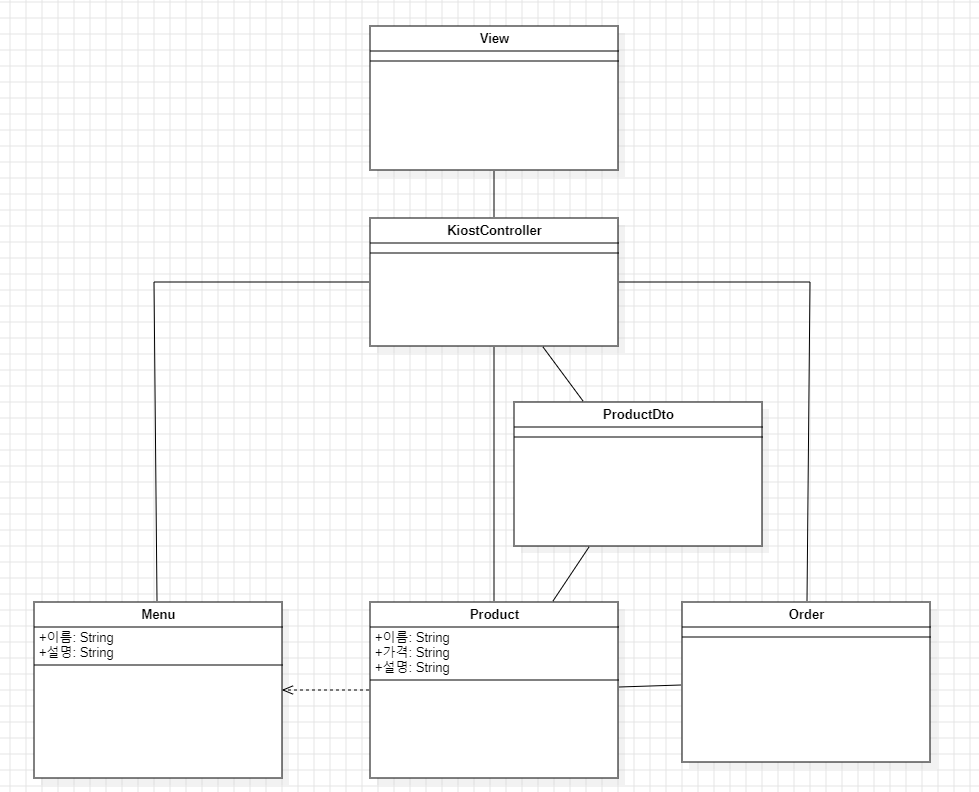

# Java-Kiosk 만들기

---

요구사항 이해:

> **Java 클래스 설계 시 필수 요구사항!**
>
> - 메뉴 클래스는 이름, 설명 필드를 가지는 클래스로 만들어주세요.
> - 상품 클래스는 이름, 가격, 설명 필드를 가지는 클래스로 만들어주세요.
> - 상품 클래스의 이름, 설명 필드는 메뉴 클래스를 상속받아 사용하는 구조로 개발해주세요.
> - 주문 클래스도 만들어서 상품 객체를 담을 수 있도록 해주세요.

1. 메인 메뉴판 화면
    - 메인 메뉴판이 출력되며 메뉴판에는 상품 메뉴가 출력 됩니다.
    - 상품 메뉴는 간단한 설명과 함께 출력 되며 최소 3개 이상 출력 됩니다.
    - 상품 메뉴 아래에는 Order(주문)와 Cancel(주문 취소) 옵션을 출력해줍니다.

2. 상품 메뉴판 화면
    - 상품 메뉴 선택 시 해당 카테고리의 메뉴판이 출력됩니다.
    - 메뉴판에는 각 메뉴의 이름과 가격과 간단한 설명이 표시됩니다.

3. 구매 화면
    - 상품 선택 시 해당 상품을 장바구니에 추가할지 확인하는 문구가 출력 됩니다.
    - `1.확인` 입력 시 장바구니에 추가되었다는 안내 문구와 함께 메인 메뉴로 다시 출력 됩니다.

4. 주문 화면
    - `5.Order` 입력 시 장바구니 목록을 출력해줍니다.
    - 장바구니에서는 추가된 메뉴들과 총 가격의 합을 출력해줍니다.
    - `1.주문` 입력 시 주문완료 화면으로 넘어가고, `2.메뉴판` 입력 시 다시 메인 메뉴로 돌아옵니다.

5. 주문완료 화면
    - `1.주문` 입력 시 대기번호를 발급해줍니다.
    - 장바구니는 초기화되고 3초 후에 메인 메뉴판으로 돌아갑니다.

6. 주문 취소 화면
    - 메뉴판에서 `6.Cancel` 입력시 주문을 취소할지 확인을 요청하는 문구가 출력 됩니다.
    - `1.확인` 을 입력하면 장바구니는 초기화되고 취소 완료 문구와 함께 메뉴판이 출력 됩니다.

----

1. 주문 개수 기능 추가
    - 장바구니에 똑같은 상품이 담기면 주문 화면에서 상품 개수가 출력 되도록 합니다.

2. 상품 옵션 기능 추가
    - 상품에 옵션을 선택 후 장바구니에 추가 할 수 있게 세분화 합니다.

3. 총 판매금액 조회 기능 추가
    - 구매가 완료될 때마다 총 판매 금액을 누적해줍니다.
    - 숨겨진 기능으로 0번 입력 시 총 판매금액을 출력합니다.

4. 총 판매상품 목록 조회 기능 추가
    - 구매가 완료될 때마다 판매 상품 목록을 저장해줍니다.
    - 숨겨진 기능으로 0번 입력 시 총 판매 상품 목록을 출력합니다.

----

설계:

상세 메소드는 추후 작성

----
기술 스택 선택:

JDK (17.0.6)

----
테스트:

예외처리 부분 추가 필요

- 사용자 입력부분에서 숫자가 아닌 값을 사용하면 일괄적으로 7로 변경하게 하였지만 Index범위 관련 Exception에 대해 아직 대처하지 못함

----
디버깅 및 최적화:

- KioskController에서 start() 내부 메인 로직에 관련한 세부 메소드 분리가 진행 전임
- 상수를 이용한 클린코드 적용 전

----
사용자 피드백 수용:

만약 가능하다면 키오스크 애플리케이션을 사용해보고 사용자 피드백을 수용하여 개선점을 찾습니다.

----
문서화:

코드, 설계, 사용법 등에 대한 문서를 작성 -> 향후 유지보수를 위해 

----
유지보수:

배포 이후에도 사용자 피드백 및 발생한 이슈에 대응하며 필요한 경우 추가 기능이나 개선을 진행합니다.
